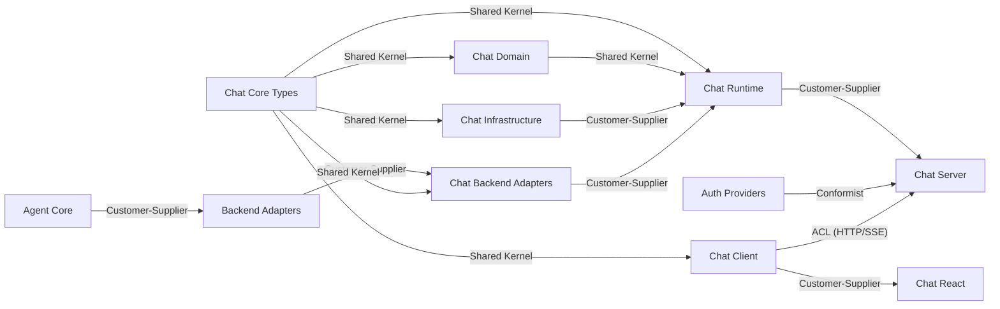

# Bounded Context Map

> **Note**: BC Map arrows follow DDD convention (upstream → downstream). Container diagram arrows follow code dependency direction. Both are correct but may appear reversed when compared.

## Context Details

| Context | Subdomain | Responsibility | Owned Entities |
|---------|-----------|----------------|----------------|
| Agent Core | Core | Base agent abstraction: run/stream with state machine, retry, abort | IAgentService, BaseAgent, ToolDefinition, ToolContext, Message, AgentEvent, RunOptions |
| Backend Adapters | Core | Vendor SDK wrappers translating to AgentEvent stream | CopilotAgentService, ClaudeAgentService, VercelAIAgentService |
| Auth Providers | Supporting | OAuth flows for backends. No token storage. | CopilotAuth, ClaudeAuth, AuthToken, TokenRefreshManager |
| Chat Core Types | Core | Leaf type definitions, guards, bridge functions | ChatEvent, ChatMessage, ChatSession, ChatId, MessagePart |
| Chat Infrastructure | Supporting | Data persistence: storage adapters, session/provider/token stores | IChatSessionStore, IStorageAdapter, SQLiteSessionStore, SQLiteProviderStore |
| Chat Domain | Core | Business rules: state machines, errors, context trimming, accumulation | StateMachine, ChatError, ContextWindowManager, MessageAccumulator |
| Chat Backend Adapters | Core | Bridges IAgentService to ChatEvent streams. Transport layer. | IChatBackend, CopilotChatAdapter, SSEChatTransport, WsChatTransport |
| Chat Runtime | Core | Server-side orchestrator: sessions, adapters, middleware, streaming | IChatRuntime, ChatRuntime, BackendAdapterFactory, ChatMiddleware |
| Chat Server | Supporting | HTTP handlers, routing, provider/model resolution, auth endpoints | createChatHandler, createAuthHandler, createChatServer |
| Chat Client | Core | HTTP/SSE proxy with local provider selection state | IChatClient, RemoteChatClient, SelectionChangeCallback |
| Chat React | Supporting | React hooks and headless components consuming IChatClient | ChatProvider, useChat, useMessages, ChatUI, useRemoteChat |

## Integration Mechanisms

| Relationship | Type | Mechanism |
|-------------|------|-----------|
| ChatTypes → all chat modules | Shared Kernel | Direct TypeScript imports of shared types |
| AgentCore → Backend Adapters | Customer-Supplier | Abstract class extension (BaseAgent) |
| ChatBackends → Runtime | Customer-Supplier | IChatBackend interface + factory pattern |
| Runtime → Server | Customer-Supplier | IChatRuntime interface method calls |
| Client → Server | ACL (Anti-Corruption Layer) | HTTP/SSE protocol. RemoteChatClient translates server responses to IChatClient contract. |
| Auth → Server | Conformist | Server conforms to auth class interfaces (ICopilotAuth, IClaudeAuth) |
| Client → React | Customer-Supplier | IChatClient consumed directly by React hooks |
