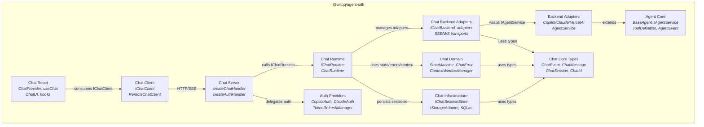

# Container Diagram (C4 Level 2)

## Module Responsibilities

| Module | Entry Point | Responsibility |
|--------|-------------|----------------|
| Agent Core | `@witqq/agent-sdk` | Base agent abstraction: state machine, retry, abort |
| Backend Adapters | `@witqq/agent-sdk/{copilot,claude,vercel-ai}` | Vendor SDK wrappers → AgentEvent stream |
| Auth Providers | `@witqq/agent-sdk/auth` | OAuth flows (no token storage) |
| Chat Core Types | `@witqq/agent-sdk/chat/core` | Leaf types: ChatEvent, ChatMessage, ChatSession |
| Chat Infrastructure | `@witqq/agent-sdk/chat/{storage,sessions,sqlite}` | Data persistence adapters |
| Chat Domain | `@witqq/agent-sdk/chat/{state,errors,context,accumulator}` | Business rules: state machines, errors, context |
| Chat Backend Adapters | `@witqq/agent-sdk/chat/backends` | IChatBackend bridge + transports |
| Chat Runtime | `@witqq/agent-sdk/chat/runtime` | Server orchestrator: sessions + middleware + streaming |
| Chat Server | `@witqq/agent-sdk/chat/server` | HTTP handlers + routing + provider resolution |
| Chat Client | `@witqq/agent-sdk/chat/react` (RemoteChatClient) | HTTP/SSE proxy with local provider selection |
| Chat React | `@witqq/agent-sdk/chat/react` | Hooks and headless components |

## Dependency Direction

Dependencies flow **downward and inward**:
- React → Client → Server → Runtime → Domain/Infrastructure/Backend Adapters → Core Types
- No circular dependencies
- Core Types is a **leaf** — depended upon by all chat modules, depends on nothing
