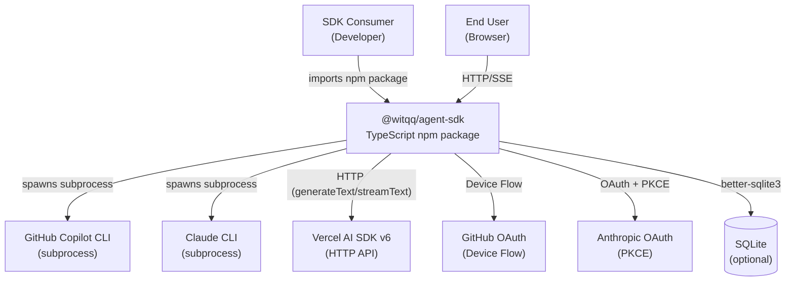

# Context Diagram (C4 Level 1)

## External Systems

| System | Protocol | Purpose |
|--------|----------|---------|
| GitHub Copilot CLI | subprocess (stdio) | Agent execution with GitHub auth |
| Claude CLI | subprocess (stdio) | Agent execution with Anthropic auth |
| Vercel AI SDK v6 | HTTP (OpenAI-compatible) | Agent execution with API key |
| GitHub OAuth | HTTPS (Device Flow) | Copilot authentication |
| Anthropic OAuth | HTTPS (Authorization Code + PKCE) | Claude authentication |
| SQLite | better-sqlite3 (file) | Session, provider, token storage |
