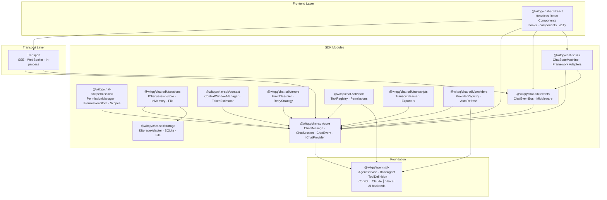

# @witqq/chat-sdk — Architecture

## Overview

**Package:** `@witqq/chat-sdk`  
**Relationship:** Built on top of `@witqq/agent-sdk` (extends, not replaces)  
**Purpose:** Vertically integrated AI chat SDK — from backend agent orchestration to transport layer to frontend headless UI components. Fills gaps that no single competitor covers: session persistence, context window management, error classification, permission UI, and transport standardization.

**Design Principles:**

1. **Modular & tree-shakeable** — each module is independently importable via subpath exports
2. **Framework-agnostic core** — core, sessions, context, errors are pure TypeScript with zero framework dependencies
3. **Headless-first UI** — React components provide logic and a11y, not styles (inspired by assistant-ui and Vercel AI Elements)
4. **Backend-agnostic** — works with any `@witqq/agent-sdk` backend (Copilot, Claude, Vercel AI, custom)
5. **Zero core dependencies** — core module has no npm dependencies; framework bindings are optional



## Package Structure

Single npm package with multiple entry points (subpath exports pattern, same as `@witqq/agent-sdk`):

```
@witqq/chat-sdk              → core types and utilities
@witqq/chat-sdk/core         → core module (messages, sessions, events, provider)
@witqq/chat-sdk/permissions  → permission management and stores
@witqq/chat-sdk/sessions     → session management and persistence
@witqq/chat-sdk/transcripts  → transcript parsing and normalization
@witqq/chat-sdk/storage      → storage adapters (SQLite, file)
@witqq/chat-sdk/context      → context window management
@witqq/chat-sdk/providers    → provider registry and switching
@witqq/chat-sdk/tools        → tool system extensions
@witqq/chat-sdk/errors       → error classification and retry
@witqq/chat-sdk/events       → event bus and middleware
@witqq/chat-sdk/ui           → headless UI state machines and adapters
@witqq/chat-sdk/react        → headless React components
```

### File Structure

```
src/
├── index.ts               — Re-exports from core
├── core/
│   ├── index.ts
│   ├── types.ts           — ChatMessage, MessageContent, ChatSession, ChatEvent, ChatProvider
│   └── utils.ts
├── permissions/
│   ├── index.ts
│   ├── types.ts           — PermissionScope, PermissionRule, IPermissionStore
│   ├── manager.ts         — PermissionManager
│   ├── memory-store.ts    — InMemoryPermissionStore
│   ├── file-store.ts      — FilePermissionStore
│   └── composite-store.ts — CompositePermissionStore
├── sessions/
│   ├── index.ts
│   ├── types.ts           — IChatSessionStore
│   ├── memory-store.ts    — InMemorySessionStore
│   └── file-store.ts      — FileSessionStore
├── transcripts/
│   ├── index.ts
│   ├── parser.ts          — TranscriptParser
│   ├── claude-parser.ts
│   ├── copilot-parser.ts
│   └── exporters.ts       — MarkdownExporter, JSONExporter
├── storage/
│   ├── index.ts
│   ├── types.ts           — IStorageAdapter
│   ├── sqlite-adapter.ts
│   └── file-adapter.ts
├── context/
│   ├── index.ts
│   ├── types.ts
│   ├── window-manager.ts  — ContextWindowManager
│   └── token-estimator.ts
├── providers/
│   ├── index.ts
│   ├── types.ts
│   ├── registry.ts        — ProviderRegistry
│   ├── openai.ts
│   ├── anthropic.ts
│   └── ollama.ts
├── tools/
│   ├── index.ts
│   ├── types.ts
│   ├── registry.ts        — ToolRegistry
│   └── permissions.ts
├── errors/
│   ├── index.ts
│   ├── types.ts
│   ├── classifier.ts      — classifyError()
│   └── retry.ts           — RetryStrategy
├── events/
│   ├── index.ts
│   ├── types.ts
│   ├── bus.ts             — ChatEventBus
│   └── middleware.ts
├── ui/
│   ├── index.ts
│   ├── state-machine.ts   — ChatStateMachine, BaseChatStateMachine
│   ├── adapters/
│   │   ├── react.ts       — ReactChatAdapter
│   │   ├── vue.ts         — VueChatAdapter
│   │   ├── svelte.ts      — SvelteChatAdapter
│   │   └── vanilla.ts     — VanillaChatAdapter
│   └── types.ts           — ChatState, MessageState, ToolCallState
└── react/
    ├── index.ts
    ├── hooks/
    │   ├── use-chat.ts
    │   ├── use-messages.ts
    │   ├── use-tools.ts
    │   └── use-provider.ts
    └── components/
        ├── ChatContainer.tsx
        ├── MessageList.tsx
        ├── MessageBubble.tsx
        ├── ToolCallView.tsx
        ├── ThinkingBlock.tsx
        └── InputArea.tsx
```

### Dependencies

| Module | Dependencies | Peer Dependencies |
|--------|-------------|-------------------|
| `core` | — | `@witqq/agent-sdk` |
| `sessions` | — | `@witqq/agent-sdk` |
| `transcripts` | — | `@witqq/agent-sdk` |
| `storage` | — | `better-sqlite3` (optional) |
| `context` | — | `@witqq/agent-sdk` |
| `providers` | — | `@witqq/agent-sdk` |
| `tools` | — | `@witqq/agent-sdk` |
| `errors` | — | `@witqq/agent-sdk` |
| `events` | — | `@witqq/agent-sdk` |
| `react` | — | `react >=18`, `@witqq/agent-sdk` |

All modules have `@witqq/agent-sdk` as a peer dependency. The `storage` module has `better-sqlite3` as an optional peer dependency. The `react` module has `react` as a peer dependency. Core modules have zero npm dependencies.

## Module: Core (`@witqq/chat-sdk/core`)

The core module defines all fundamental types used across the SDK. Zero dependencies.

```typescript
import type { AgentEvent, ToolCall, ToolResult, UsageData, ModelInfo } from '@witqq/agent-sdk';

// ─── Unique ID ─────────────────────────────────────────────────
/** Branded type for unique identifiers */
type ChatId = string & { readonly __brand: 'ChatId' };

/** Generate a new unique ID (nanoid-based) */
function createChatId(): ChatId;

// ─── Message Content Types ─────────────────────────────────────
/** Content block within a chat message */
type ChatContentPart =
  | { type: 'text'; text: string }
  | { type: 'tool-call'; toolCallId: string; toolName: string; args: Record<string, unknown>; status: 'pending' | 'running' | 'completed' | 'error' }
  | { type: 'tool-result'; toolCallId: string; toolName: string; result: unknown; isError?: boolean }
  | { type: 'thinking'; text: string; isCollapsed?: boolean }
  | { type: 'image'; url: string; alt?: string; mimeType?: string }
  | { type: 'source-citation'; title: string; url?: string; snippet?: string };

// ─── Chat Message ──────────────────────────────────────────────
/** Role of message author */
type ChatRole = 'user' | 'assistant' | 'system' | 'tool';

/** Metadata attached to messages */
interface ChatMessageMetadata {
  /** Provider/model that generated this message */
  model?: string;
  /** Backend used (copilot, claude, vercel-ai) */
  backend?: string;
  /** Token usage for this message */
  usage?: UsageData;
  /** Whether this is an archived/summarized message */
  isSummary?: boolean;
  /** Whether this message was archived from context window */
  isArchived?: boolean;
  /** Estimated token count */
  estimatedTokens?: number;
  /** Custom application metadata */
  custom?: Record<string, unknown>;
}

/** A single chat message — the fundamental unit of conversation */
interface ChatMessage {
  /** Unique message identifier */
  id: ChatId;
  /** Message role */
  role: ChatRole;
  /** Content — plain text or structured content parts */
  content: string | ChatContentPart[];
  /** Message metadata */
  metadata: ChatMessageMetadata;
  /** Tool calls made during this message (assistant only) */
  toolCalls?: ToolCall[];
  /** Tool results for this message (tool role only) */
  toolResults?: ToolResult[];
  /** Creation timestamp (ISO 8601) */
  createdAt: string;
  /** Last update timestamp */
  updatedAt?: string;
  /** Parent message ID for branching conversations */
  parentId?: ChatId;
  /** Status of this message */
  status: 'pending' | 'streaming' | 'completed' | 'error';
  /** Error information if status is 'error' */
  error?: string;
}

// ─── Chat Session ──────────────────────────────────────────────
/** Session configuration snapshot */
interface ChatSessionConfig {
  model: string;
  backend: string;
  systemPrompt?: string;
  temperature?: number;
  maxTokens?: number;
}

/** Chat session — a conversation with ordered messages */
interface ChatSession {
  /** Unique session identifier */
  id: ChatId;
  /** Human-readable title (auto-generated or user-set) */
  title?: string;
  /** Ordered messages in this session */
  messages: ChatMessage[];
  /** Session configuration */
  config: ChatSessionConfig;
  /** Session metadata */
  metadata: {
    /** Total messages count */
    messageCount: number;
    /** Total estimated tokens used */
    totalTokens: number;
    /** Session tags for filtering */
    tags?: string[];
    /** Custom application metadata */
    custom?: Record<string, unknown>;
  };
  /** Creation timestamp */
  createdAt: string;
  /** Last activity timestamp */
  updatedAt: string;
  /** Backend session ID for persistent CLI sessions */
  backendSessionId?: string;
}

// ─── Chat Events ───────────────────────────────────────────────
/** Events emitted during chat operation — superset of AgentEvent with chat-specific additions */
type ChatEvent =
  | { type: 'message_start'; messageId: ChatId; role: ChatRole }
  | { type: 'message_delta'; messageId: ChatId; text: string }
  | { type: 'message_complete'; messageId: ChatId; message: ChatMessage }
  | { type: 'tool_call_start'; messageId: ChatId; toolCallId: string; toolName: string; args: Record<string, unknown> }
  | { type: 'tool_call_end'; messageId: ChatId; toolCallId: string; toolName: string; result: unknown; isError?: boolean }
  | { type: 'thinking_start'; messageId: ChatId }
  | { type: 'thinking_delta'; messageId: ChatId; text: string }
  | { type: 'thinking_end'; messageId: ChatId }
  | { type: 'permission_request'; messageId: ChatId; toolName: string; toolArgs: Record<string, unknown> }
  | { type: 'permission_response'; messageId: ChatId; toolName: string; allowed: boolean }
  | { type: 'usage_update'; promptTokens: number; completionTokens: number; model?: string }
  | { type: 'session_created'; sessionId: ChatId }
  | { type: 'session_updated'; sessionId: ChatId }
  | { type: 'error'; error: string; recoverable: boolean; messageId?: ChatId }
  | { type: 'typing_start' }
  | { type: 'typing_end' }
  | { type: 'heartbeat' };

// ─── Chat Provider Abstraction ─────────────────────────────────
/** Options for sending a message to a provider */
interface SendMessageOptions {
  /** Abort signal for cancellation */
  signal?: AbortSignal;
  /** Model override for this request */
  model?: string;
  /** Additional context */
  context?: Record<string, unknown>;
}

/** Abstract chat provider — wraps an IAgentService for chat use */
interface IChatProvider {
  /** Provider identifier */
  readonly name: string;
  /** Send a message and get a complete response */
  sendMessage(session: ChatSession, message: string, options?: SendMessageOptions): Promise<ChatMessage>;
  /** Stream a response as ChatEvents */
  streamMessage(session: ChatSession, message: string, options?: SendMessageOptions): AsyncIterable<ChatEvent>;
  /** List available models for this provider */
  listModels(): Promise<ModelInfo[]>;
  /** Check if provider is configured and ready */
  validate(): Promise<{ valid: boolean; errors: string[] }>;
  /** Release resources */
  dispose(): Promise<void>;
}

// ─── Agent Event Adapter ───────────────────────────────────────
/** Convert AgentEvent stream to ChatEvent stream */
function adaptAgentEvents(events: AsyncIterable<AgentEvent>, messageId: ChatId): AsyncIterable<ChatEvent>;

/** Convert ChatMessage to agent-sdk Message format */
function toAgentMessage(message: ChatMessage): import('@witqq/agent-sdk').Message;

/** Convert agent-sdk Message to ChatMessage */
function fromAgentMessage(message: import('@witqq/agent-sdk').Message, id?: ChatId): ChatMessage;
```

### Public API

- `createChatId()` — generate unique IDs
- `adaptAgentEvents()` — bridge agent-sdk events to chat events
- `toAgentMessage()` / `fromAgentMessage()` — message format conversion
- All type exports (`ChatMessage`, `ChatSession`, `ChatEvent`, `IChatProvider`, etc.)

### Usage

```typescript
import { createChatId, adaptAgentEvents, type ChatMessage, type ChatSession } from '@witqq/chat-sdk/core';

const session: ChatSession = {
  id: createChatId(),
  messages: [],
  config: { model: 'claude-sonnet-4', backend: 'claude' },
  metadata: { messageCount: 0, totalTokens: 0 },
  createdAt: new Date().toISOString(),
  updatedAt: new Date().toISOString(),
};

const message: ChatMessage = {
  id: createChatId(),
  role: 'user',
  content: 'Hello, world!',
  metadata: {},
  createdAt: new Date().toISOString(),
  status: 'completed',
};
```

## Module: Sessions (`@witqq/chat-sdk/sessions`)

Session management with pluggable persistence. Addresses use case 2.6 (chat message persistence) — three projects wrote their own SQLite schemas.

```typescript
import type { ChatSession, ChatMessage, ChatId } from '@witqq/chat-sdk/core';

// ─── Session Query ─────────────────────────────────────────────
/** Filter criteria for listing sessions */
interface SessionQuery {
  /** Filter by tags */
  tags?: string[];
  /** Filter sessions updated after this date */
  updatedAfter?: string;
  /** Filter sessions updated before this date */
  updatedBefore?: string;
  /** Search in title and messages */
  search?: string;
  /** Pagination offset */
  offset?: number;
  /** Pagination limit */
  limit?: number;
  /** Sort field */
  sortBy?: 'createdAt' | 'updatedAt' | 'title';
  /** Sort direction */
  sortOrder?: 'asc' | 'desc';
}

/** Result of a paginated session list query */
interface SessionListResult {
  sessions: ChatSession[];
  total: number;
  hasMore: boolean;
}

// ─── Session Store Interface ───────────────────────────────────
/** CRUD interface for chat session persistence */
interface IChatSessionStore {
  /** Create a new session */
  create(session: ChatSession): Promise<ChatSession>;
  /** Get a session by ID, returns null if not found */
  get(sessionId: ChatId): Promise<ChatSession | null>;
  /** Update an existing session */
  update(sessionId: ChatId, updates: Partial<Pick<ChatSession, 'title' | 'metadata' | 'config'>>): Promise<ChatSession>;
  /** Delete a session and all its messages */
  delete(sessionId: ChatId): Promise<void>;
  /** List sessions with optional filtering */
  list(query?: SessionQuery): Promise<SessionListResult>;

  /** Add a message to a session */
  addMessage(sessionId: ChatId, message: ChatMessage): Promise<void>;
  /** Update an existing message (e.g., status change, content append) */
  updateMessage(sessionId: ChatId, messageId: ChatId, updates: Partial<ChatMessage>): Promise<void>;
  /** Get messages for a session with pagination */
  getMessages(sessionId: ChatId, options?: { offset?: number; limit?: number }): Promise<ChatMessage[]>;
  /** Delete a specific message */
  deleteMessage(sessionId: ChatId, messageId: ChatId): Promise<void>;

  /** Release resources (close connections, flush) */
  dispose(): Promise<void>;
}

// ─── Built-in: InMemorySessionStore ────────────────────────────
/** In-memory session store — useful for testing and ephemeral sessions */
class InMemorySessionStore implements IChatSessionStore {
  constructor();
  create(session: ChatSession): Promise<ChatSession>;
  get(sessionId: ChatId): Promise<ChatSession | null>;
  update(sessionId: ChatId, updates: Partial<Pick<ChatSession, 'title' | 'metadata' | 'config'>>): Promise<ChatSession>;
  delete(sessionId: ChatId): Promise<void>;
  list(query?: SessionQuery): Promise<SessionListResult>;
  addMessage(sessionId: ChatId, message: ChatMessage): Promise<void>;
  updateMessage(sessionId: ChatId, messageId: ChatId, updates: Partial<ChatMessage>): Promise<void>;
  getMessages(sessionId: ChatId, options?: { offset?: number; limit?: number }): Promise<ChatMessage[]>;
  deleteMessage(sessionId: ChatId, messageId: ChatId): Promise<void>;
  dispose(): Promise<void>;
  /** Get count of stored sessions */
  get size(): number;
  /** Clear all data */
  clear(): Promise<void>;
}

// ─── Built-in: FileSessionStore ────────────────────────────────
/** File-based session store — JSON files on disk, one per session */
class FileSessionStore implements IChatSessionStore {
  constructor(options: { directory: string; prettyPrint?: boolean });
  create(session: ChatSession): Promise<ChatSession>;
  get(sessionId: ChatId): Promise<ChatSession | null>;
  update(sessionId: ChatId, updates: Partial<Pick<ChatSession, 'title' | 'metadata' | 'config'>>): Promise<ChatSession>;
  delete(sessionId: ChatId): Promise<void>;
  list(query?: SessionQuery): Promise<SessionListResult>;
  addMessage(sessionId: ChatId, message: ChatMessage): Promise<void>;
  updateMessage(sessionId: ChatId, messageId: ChatId, updates: Partial<ChatMessage>): Promise<void>;
  getMessages(sessionId: ChatId, options?: { offset?: number; limit?: number }): Promise<ChatMessage[]>;
  deleteMessage(sessionId: ChatId, messageId: ChatId): Promise<void>;
  dispose(): Promise<void>;
}
```

### Usage

```typescript
import { InMemorySessionStore } from '@witqq/chat-sdk/sessions';
import { createChatId } from '@witqq/chat-sdk/core';

const store = new InMemorySessionStore();
const session = await store.create({
  id: createChatId(),
  messages: [],
  config: { model: 'gpt-4.1', backend: 'vercel-ai' },
  metadata: { messageCount: 0, totalTokens: 0 },
  createdAt: new Date().toISOString(),
  updatedAt: new Date().toISOString(),
});
```

## Module: Context Management (`@witqq/chat-sdk/context`)

Sliding window context management with token counting. Addresses use case 2.9 — both Moira and Planeta implemented this from scratch.

```typescript
import type { ChatMessage, ChatSession } from '@witqq/chat-sdk/core';

// ─── Token Estimation ──────────────────────────────────────────
/** Model family for token estimation accuracy */
type ModelFamily = 'gpt' | 'claude' | 'gemini' | 'llama' | 'generic';

/** Token estimation options */
interface TokenEstimationOptions {
  /** Model family for more accurate estimation */
  modelFamily?: ModelFamily;
  /** Whether to count tool call arguments and results */
  includeToolCalls?: boolean;
}

/** Estimate token count for text */
function estimateTokens(text: string, options?: TokenEstimationOptions): number;

/** Estimate token count for a single message */
function estimateMessageTokens(message: ChatMessage, options?: TokenEstimationOptions): number;

/** Estimate token count for an array of messages */
function estimateSessionTokens(messages: ChatMessage[], options?: TokenEstimationOptions): number;

// ─── Context Window Configuration ──────────────────────────────
/** Configuration for the context window manager */
interface ContextWindowConfig {
  /** Maximum token budget for the context window */
  maxTokens: number;
  /** Reserved tokens for system prompt */
  systemPromptReserve?: number;
  /** Reserved tokens for the response */
  responseReserve?: number;
  /** Model family for token estimation */
  modelFamily?: ModelFamily;
  /** Strategy when window overflows */
  overflowStrategy: 'truncate-oldest' | 'summarize' | 'archive';
  /** Callback for AI-based summarization (required if strategy is 'summarize') */
  summarizer?: (messages: ChatMessage[]) => Promise<string>;
  /** Percentage threshold to trigger overflow handling (0-1, default: 0.9) */
  overflowThreshold?: number;
}

/** Result of context window assembly */
interface ContextWindowResult {
  /** Messages that fit in the context window */
  messages: ChatMessage[];
  /** Total estimated tokens of included messages */
  totalTokens: number;
  /** Available tokens remaining */
  remainingTokens: number;
  /** Messages that were excluded */
  excluded: ChatMessage[];
  /** Whether overflow handling was triggered */
  overflowTriggered: boolean;
  /** Summary message if summarization occurred */
  summaryMessage?: ChatMessage;
}

// ─── Context Window Manager ────────────────────────────────────
/** Manages context window assembly for chat sessions */
class ContextWindowManager {
  constructor(config: ContextWindowConfig);

  /** Assemble a context window from session messages.
   *  Priority: system prompt → summaries → recent messages (reverse-chronological) */
  assemble(messages: ChatMessage[], systemPrompt?: string): Promise<ContextWindowResult>;

  /** Check if a new message would exceed the context window */
  wouldOverflow(currentMessages: ChatMessage[], newMessage: ChatMessage): boolean;

  /** Emergency trim — remove 50% of messages when context overflows unexpectedly */
  emergencyTrim(messages: ChatMessage[], targetPercentage?: number): ChatMessage[];

  /** Get current configuration */
  getConfig(): Readonly<ContextWindowConfig>;

  /** Update configuration */
  updateConfig(updates: Partial<ContextWindowConfig>): void;
}
```

### Usage

```typescript
import { ContextWindowManager, estimateTokens } from '@witqq/chat-sdk/context';

const manager = new ContextWindowManager({
  maxTokens: 128000,
  systemPromptReserve: 2000,
  responseReserve: 4096,
  modelFamily: 'claude',
  overflowStrategy: 'truncate-oldest',
  overflowThreshold: 0.9,
});

const result = await manager.assemble(session.messages, 'You are a helpful assistant.');
console.log(`Using ${result.totalTokens}/${128000} tokens, ${result.excluded.length} messages excluded`);

// Token estimation utility
const tokens = estimateTokens('Hello, world!', { modelFamily: 'gpt' });
```

## Module: Error Handling (`@witqq/chat-sdk/errors`)

Canonical error classification, retry strategies, and error broadcasting. Eliminates the duplicate `classifyError()` implementations in Supervisor and Podcast, and implements the `ErrorHandlingConfig.retryLLM` capability declared but never implemented in agent-sdk.

```typescript
// ─── Error hierarchy ───────────────────────────────────────────
export class ChatSDKError extends Error {
  /** Machine-readable error code. */
  readonly code: string;
  /** Whether this error is retryable. */
  readonly retryable: boolean;
  /** Original cause, if wrapping another error. */
  readonly cause?: unknown;
  /** ISO-8601 timestamp when the error occurred. */
  readonly timestamp: string;

  constructor(message: string, options: ChatSDKErrorOptions);
}

export interface ChatSDKErrorOptions {
  code: string;
  retryable?: boolean;
  cause?: unknown;
}

export class NetworkError extends ChatSDKError {
  /** HTTP status code, if available. */
  readonly statusCode?: number;
  constructor(message: string, options?: { statusCode?: number; cause?: unknown });
}

export class AuthError extends ChatSDKError {
  readonly expired: boolean;
  constructor(message: string, options?: { expired?: boolean; cause?: unknown });
}

export class RateLimitError extends ChatSDKError {
  /** Seconds until the rate limit resets. */
  readonly retryAfterSeconds?: number;
  constructor(message: string, options?: { retryAfterSeconds?: number; cause?: unknown });
}

export class ProviderError extends ChatSDKError {
  /** Provider name that generated the error. */
  readonly provider: string;
  /** Raw provider error body, if available. */
  readonly providerBody?: unknown;
  constructor(message: string, options: { provider: string; providerBody?: unknown; cause?: unknown });
}

export class ValidationError extends ChatSDKError {
  /** Field-level details. */
  readonly fields?: Record<string, string>;
  constructor(message: string, options?: { fields?: Record<string, string>; cause?: unknown });
}

export class ContextOverflowError extends ChatSDKError {
  readonly tokenCount: number;
  readonly tokenLimit: number;
  constructor(message: string, options: { tokenCount: number; tokenLimit: number; cause?: unknown });
}

export class TimeoutError extends ChatSDKError {
  readonly timeoutMs: number;
  constructor(message: string, options: { timeoutMs: number; cause?: unknown });
}

// ─── Classification ────────────────────────────────────────────
/**
 * Classifies an unknown thrown value into the correct `ChatSDKError` subclass.
 * This is the function both Supervisor and Podcast implemented independently.
 */
export function classifyError(error: unknown): ChatSDKError;

// ─── Retry ──────────────────────────────────────────────────────
export interface RetryStrategy {
  /** Return delay in ms for the given attempt (0-based), or `null` to stop. */
  nextDelay(attempt: number, error: ChatSDKError): number | null;
}

export class ExponentialBackoffStrategy implements RetryStrategy {
  constructor(options?: ExponentialBackoffOptions);
  nextDelay(attempt: number, error: ChatSDKError): number | null;
}

export interface ExponentialBackoffOptions {
  /** Base delay in ms (default: 1000). */
  baseMs?: number;
  /** Maximum delay in ms (default: 30000). */
  maxMs?: number;
  /** Maximum number of attempts (default: 3). */
  maxAttempts?: number;
  /** Jitter factor 0–1 (default: 0.1). */
  jitter?: number;
  /** Error codes that should NOT be retried. */
  nonRetryableCodes?: string[];
}

export class RetryExecutor {
  constructor(strategy: RetryStrategy);

  /**
   * Execute `fn` with automatic retries.
   * Respects `ChatSDKError.retryable` and `RateLimitError.retryAfterSeconds`.
   */
  execute<T>(fn: () => Promise<T>, options?: RetryExecuteOptions): Promise<T>;
}

export interface RetryExecuteOptions {
  /** Abort signal to cancel retries. */
  signal?: AbortSignal;
  /** Called before each retry with the error and delay. */
  onRetry?: (error: ChatSDKError, attempt: number, delayMs: number) => void;
}

// ─── Error event bus ───────────────────────────────────────────
export type ErrorListener = (error: ChatSDKError) => void;

export interface ErrorEventBus {
  /** Subscribe to all errors. */
  on(listener: ErrorListener): () => void;
  /** Subscribe to errors matching a specific class. */
  onType<T extends ChatSDKError>(
    errorClass: new (...args: any[]) => T,
    listener: (error: T) => void,
  ): () => void;
  /** Emit an error to all matching listeners. */
  emit(error: ChatSDKError): void;
  /** Remove all listeners. */
  clear(): void;
}
```

### Usage

```typescript
import {
  classifyError,
  RetryExecutor,
  ExponentialBackoffStrategy,
  RateLimitError,
} from '@witqq/chat-sdk/errors';

const retry = new RetryExecutor(
  new ExponentialBackoffStrategy({ maxAttempts: 3, baseMs: 1000 }),
);

async function callLLM(prompt: string): Promise<string> {
  return retry.execute(
    async () => {
      const res = await fetch('/api/llm', {
        method: 'POST',
        body: JSON.stringify({ prompt }),
      });
      if (!res.ok) throw new Error(`HTTP ${res.status}`);
      return res.text();
    },
    {
      onRetry: (err, attempt, delayMs) => {
        console.warn(`Retry #${attempt} in ${delayMs}ms: ${err.code}`);
      },
    },
  );
}

// Classification — works with any thrown value
try {
  await callLLM('hello');
} catch (raw) {
  const err = classifyError(raw);
  if (err instanceof RateLimitError) {
    console.log(`Rate limited, retry after ${err.retryAfterSeconds}s`);
  }
}
```

## Module: React UI (`@witqq/chat-sdk/react`)

Headless, composable React primitives for building chat interfaces. Logic-only components with WAI-ARIA attributes — no visual styling opinions.

### Hooks

```typescript
import type { ReactNode } from 'react';
import type { PermissionScope } from '@witqq/agent-sdk';

// ─── useChat ────────────────────────────────────────────────────
export interface UseChatOptions {
  /** Provider instance or provider name from registry. */
  provider: IChatProvider | string;
  /** Initial session ID.  If omitted, a new session is created. */
  sessionId?: string;
  /** Initial system message. */
  systemMessage?: string;
  /** Maximum messages in context window (for UI-side truncation hints). */
  maxMessages?: number;
  /** Called when the provider emits an error. */
  onError?: (error: import('@witqq/chat-sdk/errors').ChatSDKError) => void;
  /** Called when the session changes. */
  onSessionChange?: (sessionId: string) => void;
}

export interface UseChatReturn {
  /** Current session ID. */
  sessionId: string | null;
  /** Send a user message and trigger an assistant response. */
  sendMessage: (content: string, options?: SendMessageOptions) => Promise<void>;
  /** Stop the current generation. */
  stop: () => void;
  /** Whether the assistant is currently generating. */
  isGenerating: boolean;
  /** Current error, if any. */
  error: import('@witqq/chat-sdk/errors').ChatSDKError | null;
  /** Clear the error state. */
  clearError: () => void;
  /** Create a new session, resetting messages. */
  newSession: () => Promise<string>;
  /** Internal event bus for this chat instance. */
  eventBus: import('@witqq/chat-sdk/events').ChatEventBus;
}

// ─── useMessages ────────────────────────────────────────────────
export interface UseMessagesOptions {
  sessionId: string;
  /** Page size for pagination (default: 50). */
  pageSize?: number;
}

export interface UseMessagesReturn {
  /** Ordered message list (oldest first). */
  messages: ChatMessage[];
  /** Whether older messages are being loaded. */
  isLoadingMore: boolean;
  /** Load the previous page of messages. */
  loadMore: () => Promise<void>;
  /** Whether more messages exist above the current window. */
  hasMore: boolean;
  /** Current streaming text fragment (partial assistant message). */
  streamingContent: string | null;
  /** Append a message locally (optimistic update). */
  appendLocal: (message: ChatMessage) => void;
}

// ─── useTools ───────────────────────────────────────────────────
export interface UseToolsOptions {
  eventBus: import('@witqq/chat-sdk/events').ChatEventBus;
  /** Called when a tool requests permission. */
  onPermissionRequest?: (
    toolName: string,
    args: unknown,
    respond: (approved: boolean, scope?: PermissionScope) => void,
  ) => void;
}

export interface UseToolsReturn {
  /** Currently active tool calls. */
  activeTools: ToolCallState[];
  /** Completed tool calls for the current turn. */
  completedTools: ToolCallState[];
  /** Approve a pending permission request. */
  approve: (toolName: string, scope?: PermissionScope) => void;
  /** Reject a pending permission request. */
  reject: (toolName: string) => void;
}

// ─── useProvider ────────────────────────────────────────────────
export interface UseProviderOptions {
  /** Registry to query for available providers. */
  registry: import('@witqq/chat-sdk/providers').ProviderRegistry;
  /** Initial provider name. */
  initialProvider?: string;
  /** Initial model within the provider. */
  initialModel?: string;
}

export interface UseProviderReturn {
  /** Currently selected provider name. */
  provider: string | null;
  /** Currently selected model. */
  model: string | null;
  /** Available providers from the registry. */
  availableProviders: string[];
  /** Available models for the current provider. */
  availableModels: string[];
  /** Switch provider. */
  setProvider: (name: string) => Promise<void>;
  /** Switch model within the current provider. */
  setModel: (model: string) => void;
  /** Whether models are being loaded. */
  isLoadingModels: boolean;
}
```

### Components

All components are headless — they render semantic HTML with `data-*` attributes and WAI-ARIA roles but no visual styles.

```typescript
import type { ReactNode, HTMLAttributes, TextareaHTMLAttributes } from 'react';

// ─── ChatContainer ──────────────────────────────────────────────
export interface ChatContainerProps extends HTMLAttributes<HTMLDivElement> {
  /** UseChatReturn from the useChat hook. */
  chat: UseChatReturn;
  children: ReactNode;
  /** Additional class name. */
  className?: string;
}

/**
 * Context wrapper — provides chat state to all descendant components.
 * Renders `<div role="log" aria-live="polite">`.
 */
export declare const ChatContainer: React.FC<ChatContainerProps>;

// ─── MessageList ────────────────────────────────────────────────
export interface MessageListProps extends HTMLAttributes<HTMLDivElement> {
  messages: ChatMessage[];
  /** Render function for each message.  Receives the message and index. */
  renderMessage?: (message: ChatMessage, index: number) => ReactNode;
  /** Whether to auto-scroll to the bottom on new messages. */
  autoScroll?: boolean;
  /** Called when the user scrolls to the top (for pagination). */
  onLoadMore?: () => void;
  /** Whether more messages are available above. */
  hasMore?: boolean;
  className?: string;
}

/**
 * Virtualized message list with auto-scroll.
 * Renders `<div role="list">` with each message as `<div role="listitem">`.
 */
export declare const MessageList: React.FC<MessageListProps>;

// ─── MessageBubble ──────────────────────────────────────────────
export interface MessageBubbleProps extends HTMLAttributes<HTMLDivElement> {
  message: ChatMessage;
  /** Whether this message is currently streaming. */
  isStreaming?: boolean;
  /** Render function for message content (defaults to plain text). */
  renderContent?: (content: string, role: string) => ReactNode;
  className?: string;
}

/**
 * Single message display with role-based rendering.
 * Sets `data-role="user|assistant|system"` and `data-streaming` attributes.
 */
export declare const MessageBubble: React.FC<MessageBubbleProps>;

// ─── ToolCallView ───────────────────────────────────────────────
export interface ToolCallViewProps extends HTMLAttributes<HTMLDivElement> {
  toolCall: ToolCallState;
  /** Render function for the tool result. */
  renderResult?: (result: unknown) => ReactNode;
  /** Render function for tool arguments. */
  renderArgs?: (args: unknown) => ReactNode;
  /** Called when the user approves a pending tool. */
  onApprove?: () => void;
  /** Called when the user rejects a pending tool. */
  onReject?: () => void;
  className?: string;
}

/**
 * Tool call display with status indicator.
 * Sets `data-status="pending|running|completed|error"`.
 * Shows approve/reject buttons when status is `pending`.
 */
export declare const ToolCallView: React.FC<ToolCallViewProps>;

// ─── ThinkingBlock ──────────────────────────────────────────────
export interface ThinkingBlockProps extends HTMLAttributes<HTMLDivElement> {
  /** Thinking/reasoning text content. */
  content: string;
  /** Whether thinking is still in progress. */
  isThinking?: boolean;
  /** Whether the block starts collapsed (default: true). */
  defaultCollapsed?: boolean;
  /** Render function for thinking content. */
  renderContent?: (content: string) => ReactNode;
  className?: string;
}

/**
 * Collapsible thinking/reasoning display.
 * Uses `<details>/<summary>` for native collapse.
 * Sets `data-thinking="active|complete"` and `aria-expanded`.
 */
export declare const ThinkingBlock: React.FC<ThinkingBlockProps>;

// ─── InputArea ──────────────────────────────────────────────────
export interface InputAreaProps extends Omit<TextareaHTMLAttributes<HTMLTextAreaElement>, 'onSubmit'> {
  /** Called when the user submits (Enter without Shift). */
  onSubmit: (content: string) => void;
  /** Called when the user clicks stop. */
  onStop?: () => void;
  /** Whether the assistant is currently generating. */
  isGenerating?: boolean;
  /** Placeholder text (default: "Type a message…"). */
  placeholder?: string;
  /** Maximum rows before scrolling (default: 6). */
  maxRows?: number;
  /** Whether to show the stop button during generation. */
  showStopButton?: boolean;
  /** Render function for the send button. */
  renderSendButton?: (props: { disabled: boolean; onClick: () => void }) => ReactNode;
  /** Render function for the stop button. */
  renderStopButton?: (props: { onClick: () => void }) => ReactNode;
  className?: string;
}

/**
 * Auto-resizing textarea with send/stop controls.
 * Submit on Enter, newline on Shift+Enter.
 * Sets `aria-label="Message input"` and manages focus.
 */
export declare const InputArea: React.FC<InputAreaProps>;
```

### Usage Example

```tsx
import { ChatContainer, MessageList, MessageBubble, InputArea, ThinkingBlock, ToolCallView } from '@witqq/chat-sdk/react';
import { useChat, useMessages, useTools } from '@witqq/chat-sdk/react';

function MyChatUI() {
  const chat = useChat({ provider: 'openai' });
  const { messages, streamingContent } = useMessages({ sessionId: chat.sessionId! });
  const { activeTools, approve, reject } = useTools({
    eventBus: chat.eventBus,
    onPermissionRequest: (toolName, args, respond) => {
      // Show confirmation dialog in UI — respond() called from ToolCallView buttons
    },
  });

  return (
    <ChatContainer chat={chat} className="my-chat">
      <MessageList
        messages={messages}
        renderMessage={(msg) => (
          <MessageBubble key={msg.id} message={msg} />
        )}
        autoScroll
      />

      {activeTools.map((tc) => (
        <ToolCallView
          key={tc.toolCallId}
          toolCall={tc}
          onApprove={() => approve(tc.toolName)}
          onReject={() => reject(tc.toolName)}
        />
      ))}

      <InputArea
        onSubmit={(text) => chat.sendMessage(text)}
        onStop={chat.stop}
        isGenerating={chat.isGenerating}
        placeholder="Ask anything…"
      />
    </ChatContainer>
  );
}
```

## Dependency Graph

```
┌─────────────────────────────────────────────────────────────────┐
│                     External (peer deps)                        │
│  ┌──────────────┐  ┌───────┐  ┌───────────────────────────┐    │
│  │ @witqq/      │  │ react │  │ zod (^3.23 || ^4.0)       │    │
│  │ agent-sdk    │  │ ≥18   │  │                           │    │
│  └──────┬───────┘  └───┬───┘  └─────────┬─────────────────┘    │
│         │              │                │                       │
└─────────┼──────────────┼────────────────┼───────────────────────┘
          │              │                │
          ▼              │                │
┌─────────────────┐      │                │
│  core            │      │                │
│  (agent-sdk)     │      │                │
└────────┬────────┘      │                │
         │               │                │
         ▼               │                ▼
┌─────────────────┐      │      ┌─────────────────┐
│  errors          │      │      │  tools           │
│  (standalone)    │      │      │  (agent-sdk,zod) │
└────────┬────────┘      │      └────────┬────────┘
         │               │               │
         ▼               │               │
┌─────────────────┐      │               │
│  events          │      │               │
│  (standalone)    │      │               │
└────────┬────────┘      │               │
         │               │               │
         ▼               │               ▼
┌─────────────────┐      │      ┌─────────────────┐
│  permissions     │      │      │  sessions        │
│  (core only)     │      │      │  (core, events,  │
└────────┬────────┘      │      │   errors)        │
         │               │      └────────┬────────┘
         │               │               │
         ├───────────────┼───────────────┤
         ▼               ▼               ▼
┌──────────────────────────────┐
│  ui                           │
│  (core, events)              │
└──────────────┬───────────────┘
               │
               ▼
┌──────────────────────────────┐
│  providers                    │
│  (agent-sdk, sessions, ui,    │
│   events, errors, tools)      │
└──────────────┬───────────────┘
               │
               ▼
┌──────────────────────────────┐
│  react                        │
│  (react, ui, providers,       │
│   events, tools, sessions)    │
└──────────────────────────────┘
```

**Circular dependency check:** None. The graph is a strict DAG.

**Independent import paths** — each module can be imported without pulling siblings:

| Module | Independent? | Notes |
|---|---|---|
| `@witqq/chat-sdk/core` | ✅ | Only agent-sdk peer dep |
| `@witqq/chat-sdk/errors` | ✅ | Zero internal deps |
| `@witqq/chat-sdk/events` | ✅ | Zero internal deps |
| `@witqq/chat-sdk/permissions` | ✅ | Only core dep |
| `@witqq/chat-sdk/tools` | ✅ | Only peer dep on agent-sdk + zod |
| `@witqq/chat-sdk/ui` | ✅ | Only core + events deps |
| `@witqq/chat-sdk/sessions` | ⚠️ | Needs core + events + errors |
| `@witqq/chat-sdk/providers` | ❌ | Needs most modules |
| `@witqq/chat-sdk/react` | ❌ | Needs multiple modules |

## Tree-shaking Verification

### Isolation via Separate Entry Points

Each module is a separate entry point in `package.json` exports. Bundlers (webpack, rollup, esbuild, vite) resolve only the imported entry, so unused modules are never parsed.

```jsonc
// package.json (excerpt)
{
  "name": "@witqq/chat-sdk",
  "type": "module",
  "sideEffects": false,
  "exports": {
    ".":              { "import": "./dist/index.mjs",       "require": "./dist/index.cjs",       "types": "./dist/index.d.ts" },
    "./core":         { "import": "./dist/core.mjs",        "require": "./dist/core.cjs",        "types": "./dist/core.d.ts" },
    "./errors":       { "import": "./dist/errors.mjs",      "require": "./dist/errors.cjs",      "types": "./dist/errors.d.ts" },
    "./events":       { "import": "./dist/events.mjs",      "require": "./dist/events.cjs",      "types": "./dist/events.d.ts" },
    "./permissions":  { "import": "./dist/permissions.mjs", "require": "./dist/permissions.cjs", "types": "./dist/permissions.d.ts" },
    "./tools":        { "import": "./dist/tools.mjs",       "require": "./dist/tools.cjs",       "types": "./dist/tools.d.ts" },
    "./ui":           { "import": "./dist/ui.mjs",          "require": "./dist/ui.cjs",          "types": "./dist/ui.d.ts" },
    "./sessions":     { "import": "./dist/sessions.mjs",    "require": "./dist/sessions.cjs",    "types": "./dist/sessions.d.ts" },
    "./transcripts":  { "import": "./dist/transcripts.mjs", "require": "./dist/transcripts.cjs", "types": "./dist/transcripts.d.ts" },
    "./storage":      { "import": "./dist/storage.mjs",     "require": "./dist/storage.cjs",     "types": "./dist/storage.d.ts" },
    "./context":      { "import": "./dist/context.mjs",     "require": "./dist/context.cjs",     "types": "./dist/context.d.ts" },
    "./providers":    { "import": "./dist/providers.mjs",   "require": "./dist/providers.cjs",   "types": "./dist/providers.d.ts" },
    "./react":        { "import": "./dist/react.mjs",       "require": "./dist/react.cjs",       "types": "./dist/react.d.ts" }
  },
  "peerDependencies": {
    "@witqq/agent-sdk": "^1.0.0",
    "react": ">=18.0.0",
    "zod": "^3.23.0 || ^4.0.0"
  },
  "peerDependenciesMeta": {
    "react": { "optional": true },
    "zod": { "optional": true }
  }
}
```

### Import Path Strategy

```typescript
// ✅ Fine-grained (best tree-shaking)
import { classifyError } from '@witqq/chat-sdk/errors';
import { ChatEventBus } from '@witqq/chat-sdk/events';
import { PermissionManager } from '@witqq/chat-sdk/permissions';
import { ChatStateMachine } from '@witqq/chat-sdk/ui';

// ✅ Module-level (still isolated)
import * as errors from '@witqq/chat-sdk/errors';
import * as permissions from '@witqq/chat-sdk/permissions';

// ⚠️ Barrel import (pulls all modules)
import { classifyError, ChatEventBus, PermissionManager } from '@witqq/chat-sdk';
```

The barrel `@witqq/chat-sdk` re-exports all modules for convenience but is **not recommended** for production builds. Each sub-path import resolves to an independent chunk with no cross-module side effects.

### Side-Effect-Free Guarantee

- `"sideEffects": false` in `package.json` signals to bundlers that all modules are safe to tree-shake
- No module-level code runs on import — all classes and functions are inert until called
- `react` module uses no global registrations; components are pure function components

## Compatibility with Current agent-sdk

### Interface Mapping

| agent-sdk Interface | chat-sdk Interface | Relationship |
|---|---|---|
| `Message` | `ChatMessage` | **Extended** — adds `id`, `sessionId`, `parentId`, `metadata`, `attachments` |
| `AgentEvent` (15 types) | `ChatEventMap` (17 types) | **Extended** — adds `message_start`, `message_end`; compatible type union |
| `ToolDeclaration` | — | **Reused as-is** — `ChatToolDefinition` extends `ToolDefinition` which extends `ToolDeclaration` |
| `ToolDefinition` | `ChatToolDefinition` | **Extended** — adds `chat: ChatToolMetadata` |
| `PermissionScope` | — | **Reused as-is** — same `"once" \| "session" \| "project" \| "always"` |
| `PermissionRequest` | — | **Reused as-is** — `ToolPermissionInterceptor` uses the same shape |
| `IPermissionStore` | — | **Reused as-is** — `IChatProvider.permissionStore` accepts `IPermissionStore` |
| `InMemoryPermissionStore` | — | **Reused as-is** |
| `FilePermissionStore` | — | **Reused as-is** |
| `CompositePermissionStore` | — | **Reused as-is** |
| — | `IChatSessionStore` | **New** — session persistence (memory, file, custom) |
| — | `IChatProvider` | **New** — wraps `IAgentService` with session + context management |
| — | `ChatEventBus` | **New** — typed event emitter with middleware |
| — | `ContextWindowManager` | **New** — token counting + message truncation |
| — | `ChatToolRegistry` | **New** — tool registration with categories + frontend tools |
| — | `ToolFactory<T>` | **New** — per-request tool DI |
| — | `ChatSDKError` hierarchy | **New** — error classification + retry |
| — | `RetryExecutor` | **New** — implements agent-sdk's declared `retryLLM` |
| — | `ProviderRegistry` | **New** — multi-provider management |
| — | React hooks + components | **New** — headless UI primitives |

### Coexistence Strategy

```
@witqq/agent-sdk   ← Low-level agent abstraction (stays independent)
       ▲
       │ peer dependency
       │
@witqq/chat-sdk    ← Chat-layer built on top of agent-sdk
```

- **agent-sdk remains standalone** — no changes required, no dependency on chat-sdk
- **chat-sdk declares agent-sdk as peer dep** (`"@witqq/agent-sdk": "^1.0.0"`)
- **No breaking changes** — all agent-sdk public types are compatible; `ChatMessage` is a superset of `Message`, `ChatToolDefinition` is a superset of `ToolDefinition`
- **Gradual adoption** — consumers can import individual chat-sdk modules (e.g., only `errors` or only `events`) without adopting the full stack