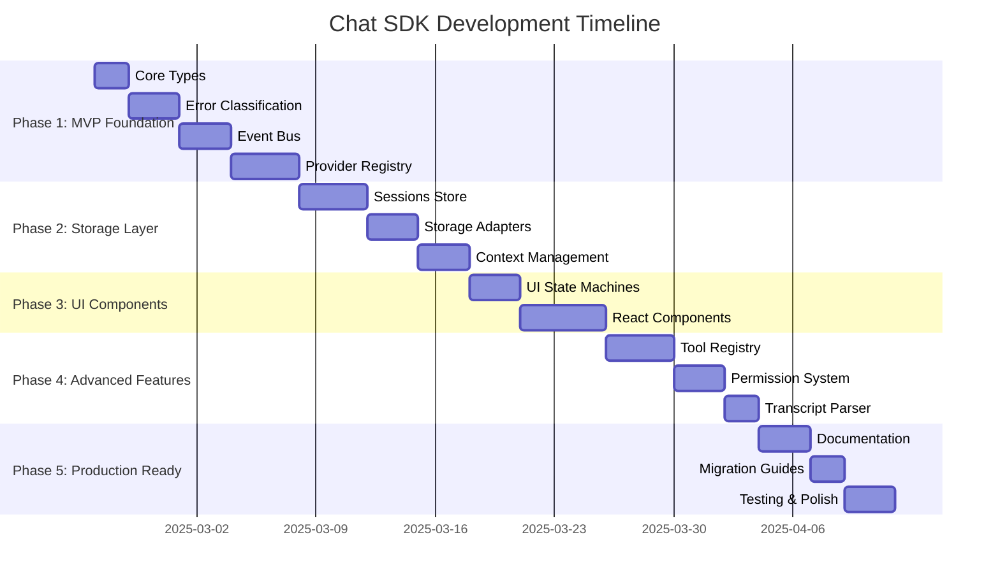

# Implementation Guide

**@witqq/chat-sdk** — Building on top of @witqq/agent-sdk

## Executive Summary

This document outlines a comprehensive 5-phase implementation strategy for `@witqq/chat-sdk`, a higher-level abstraction built on top of `@witqq/agent-sdk`. The strategy prioritizes rapid delivery of high-impact modules while maintaining zero breaking changes to existing `agent-sdk` consumers.

**Key Metrics:**
- **Total Timeline:** 8-10 weeks with 1-2 developers
- **First MVP Delivery:** 2 weeks (Phase 1)
- **Production Ready:** Week 8-10 (Phase 5)

## Implementation Phases

### Phase 1: Foundation MVP (Weeks 1-2) ⭐ **CRITICAL**

**Objective:** Deliver a working chat SDK that addresses the most critical pain points immediately.

#### Core Modules
- **`@witqq/chat-sdk/core`** — Base types and utilities (1-2 days)
- **`@witqq/chat-sdk/errors`** — Error classification and retry logic (2-3 days)
- **`@witqq/chat-sdk/providers`** — Provider registry with intelligent caching (3-4 days)
- **`@witqq/chat-sdk/events`** — Event bus with Data Stream Protocol support (2-3 days)

#### MVP Capabilities
```typescript
// Immediate value after Phase 1
import { ProviderRegistry, withAutoRefresh } from '@witqq/chat-sdk/providers';
import { classifyError, RetryExecutor } from '@witqq/chat-sdk/errors';
import { createChatEventBus } from '@witqq/chat-sdk/events';

const registry = new ProviderRegistry({ cacheTTL: 30 * 60 * 1000 });
registry.register({ id: 'claude', backend: 'claude', options: { oauthToken: token } });

const provider = await registry.getDefault();
const eventBus = createChatEventBus();
const retryExecutor = new RetryExecutor(new ExponentialBackoffStrategy());
```

#### Immediate Project Benefits
- **Moira:** Replace custom `AgentServiceRegistry` LRU cache with standardized `ProviderRegistry`
- **Supervisor:** Eliminate error handling code duplication with unified `classifyError()`
- **Podcast:** Replace 3 separate retry implementations with `RetryExecutor`
- **All Projects:** Standardize event streaming with `ChatEventBus` + serializers

---

### Phase 2: Core Extensions (Weeks 3-4)

**Objective:** Enable session management and storage foundation for persistent chat applications.

#### Core Modules
- **`@witqq/chat-sdk/sessions`** — Session CRUD with pluggable storage adapters (3-4 days)
- **`@witqq/chat-sdk/storage`** — Storage interface with SQLite/File implementations (2-3 days)
- **`@witqq/chat-sdk/context`** — Intelligent context window management (2-3 days)

#### New Capabilities
```typescript
// Persistent chat sessions with smart context management
import { InMemorySessionStore, ContextWindowManager } from '@witqq/chat-sdk/sessions';
import { ProviderRegistry } from '@witqq/chat-sdk/providers';

const sessionStore = new InMemorySessionStore();
const contextManager = new ContextWindowManager({ 
  maxTokens: 128000, 
  overflowStrategy: 'truncate-oldest' 
});
```

#### Project Migration Opportunities
- **Moira:** Replace `chat_message`/`chat_conversation` schema with `IChatSessionStore`
- **Supervisor:** Migrate `sdk_session_messages` to standardized persistence layer
- **Planeta:** Consolidate `messages`/`tool_calls` tables into unified schema
- **Moira + Planeta:** Replace custom context managers with `ContextWindowManager`

---

### Phase 3: UI Layer (Weeks 5-6)

**Objective:** Provide headless React components to eliminate UI code duplication across projects, including authentication flows, model/provider selection, and core chat primitives.

#### Core Modules
- **`@witqq/chat-sdk/ui`** — Framework-agnostic state machines (2-3 days)
- **`@witqq/chat-sdk/react`** — Headless components and hooks (4-5 days)

#### Chat Components
```tsx
// Standardized chat UI primitives
import { ChatContainer, MessageList, InputArea } from '@witqq/chat-sdk/react';
import { useChat, useMessages, useTools } from '@witqq/chat-sdk/react';

function ChatInterface() {
  const chat = useChat({ provider: 'claude' });
  const { messages } = useMessages({ sessionId: chat.sessionId });
  
  return (
    <ChatContainer chat={chat}>
      <MessageList messages={messages} />
      <InputArea onSubmit={chat.sendMessage} />
    </ChatContainer>
  );
}
```

#### Auth & Provider UI Components
```tsx
// Ready-to-use auth flows and provider/model selection
import { AuthFlow, ProviderSelector, ModelSelector } from '@witqq/chat-sdk/react';

function SetupScreen() {
  return (
    <>
      {/* Device Code Flow (Copilot), OAuth+PKCE (Claude), API key (Vercel AI) */}
      <AuthFlow provider="copilot" onAuthenticated={handleAuth} />

      {/* Provider switching with status indicators */}
      <ProviderSelector
        providers={['copilot', 'claude', 'vercel-ai']}
        onSelect={handleProviderChange}
      />

      {/* Filterable model list with manual entry fallback */}
      <ModelSelector provider={currentProvider} onSelect={handleModelChange} />
    </>
  );
}
```

#### Message Rendering Components
```tsx
// Specialized renderers for thinking, tool calls, errors, streaming
import {
  ThinkingBlock,    // Collapsible thinking/reasoning display
  ToolCallBlock,    // Tool execution with progress/result
  ErrorBlock,       // Error display with retry action
  StreamingText,    // Live text with cursor animation
} from '@witqq/chat-sdk/react';
```

#### UI Consolidation Benefits
- **Moira:** Replace `MessageList.tsx`, `ChatInput.tsx`, `ToolCallCard` with SDK components
- **Supervisor:** Migrate inline chat UI in `SessionChatPage` to SDK components
- **Planeta:** Replace custom Thread/Composer UI with standardized SDK components
- **All Projects:** Eliminate repeated auth flow UIs (Device Code, OAuth, API key forms)
- **All Projects:** Standardize model/provider selection instead of per-project implementations

---

### Phase 4: Advanced Features (Weeks 7-8)

**Objective:** Achieve complete feature parity across all project requirements.

#### Advanced Modules
- **`@witqq/chat-sdk/tools`** — Unified tool registry with frontend execution + DI (3-4 days)
- **`@witqq/chat-sdk/permissions`** — Permission management with UI integration (2-3 days)
- **`@witqq/chat-sdk/transcripts`** — Transcript parsing and export utilities (1-2 days)

#### Complete Feature Set
```typescript
// Full-featured chat SDK with advanced capabilities
import { ChatToolRegistry, ToolFactory } from '@witqq/chat-sdk/tools';
import { PermissionManager } from '@witqq/chat-sdk/permissions';
import { parseTranscript } from '@witqq/chat-sdk/transcripts';

// Eliminate all remaining project-specific implementations
```

#### Final Migration Targets
- **Moira:** Replace `ChatToolFactory` DI pattern with SDK implementation
- **Planeta:** Consolidate 3 different tool formats into unified `ChatToolRegistry`
- **Supervisor:** Migrate permission system and add transcript parsing capabilities
- **All Projects:** Complete transition to chat-sdk architecture

---

### Phase 5: Production Polish (Weeks 9-10)

**Objective:** Deliver production-ready SDK with comprehensive documentation and migration support.

#### Polish Tasks
- **Documentation:** Complete API reference with practical examples (2-3 days)
- **Migration Guides:** Project-specific migration documentation (2 days)
- **Performance:** Optimization and bundle size analysis (1-2 days)
- **Testing:** Integration tests with all consumer projects (2-3 days)

---

## Module Prioritization Matrix

| Module | Impact | Dependencies | Effort | Priority | Rationale |
|--------|:------:|:------------:|:------:|:--------:|-----------|
| **errors** | ⭐⭐⭐ | None | Low | **P1** | High-impact, zero dependencies, immediate benefits |
| **events** | ⭐⭐⭐ | None | Medium | **P1** | Transport layer foundation for all projects |
| **providers** | ⭐⭐⭐ | errors, events | Medium | **P1** | Replaces 3 cache implementations, enables hot-swapping |
| **core** | ⭐⭐ | agent-sdk | Low | **P1** | Foundation types required by all modules |
| **context** | ⭐⭐ | core | Medium | **P2** | Complex logic used by Moira + Planeta |
| **sessions** | ⭐⭐ | core, events, errors | High | **P2** | Unifies 3 different SQLite schemas |
| **ui** | ⭐⭐ | core, events | Medium | **P2** | Framework-agnostic state machines |
| **react** | ⭐⭐ | ui, events, sessions | High | **P3** | React-specific components (3 of 4 projects) |
| **tools** | ⭐ | agent-sdk, core | Medium | **P3** | Unifies tool formats and DI patterns |
| **permissions** | ⭐ | core | Medium | **P3** | Specialized for Supervisor + Planeta |
| **transcripts** | ⭐ | core | Low | **P3** | Supervisor-specific parsing requirements |
| **storage** | ⭐ | None | Medium | **P3** | Abstraction layer, direct SQLite acceptable |

### Priority Rationale
- **P1 modules:** Solve immediate pain points with minimal dependencies
- **P2 modules:** Provide major functionality requiring P1 foundation
- **P3 modules:** Complete feature parity but non-blocking for adoption

---

## Implementation Timeline



### Parallelization Opportunities
- **Weeks 1-2:** Core + Errors (parallel) → Events → Providers (sequential)
- **Weeks 3-4:** Sessions + Storage (parallel) → Context (depends on both)
- **Weeks 5-6:** UI development independent of React preparation
- **Weeks 7-8:** Tools + Permissions (parallel) → Transcripts (minimal dependencies)

---

## Code Reuse Strategy

### Direct Reuse (Import As-Is)

| Agent SDK Component | Line Reference | Chat SDK Usage | Strategy |
|---------------------|---------------|----------------|----------|
| **PermissionScope** | `types.ts:86` | `permissions/types.ts` | ✅ **Direct Import** - Identical enum values |
| **PermissionRequest** | `types.ts:143-149` | `permissions/manager.ts` | ✅ **Direct Import** - Compatible interface |
| **IPermissionStore** | `permission-store.ts:20-27` | `permissions/index.ts` | ✅ **Re-export** - Extend as `IChatPermissionStore` |
| **Permission Stores** | `permission-store.ts:29-286` | `permissions/index.ts` | ✅ **Re-export** - Compatible implementations |
| **zodToJsonSchema** | `utils/schema.ts:15-60` | `tools/registry.ts` | ✅ **Direct Import** - Zod v3/v4 compatibility |

### Extension Required (Adapt & Enhance)

| Agent SDK Component | Chat SDK Adaptation | Approach |
|---------------------|-------------------|----------|
| **Message** (`types.ts:131-137`) | → **ChatMessage** (`core/types.ts`) | ✅ **Extend** - Add `id`, `sessionId`, `metadata`, `status`, timestamps |
| **ToolDeclaration** (`types.ts:94-104`) | → **ChatToolDefinition** (`tools/types.ts`) | ✅ **Extend** - Add chat-specific metadata (category, target, UI props) |
| **AgentEvent** (15 types) | → **ChatEventMap** (`events/types.ts`) | ✅ **Extend** - Add `message_start`, `message_end`; maintain compatibility |
| **BaseAgent** (`base-agent.ts:45-145`) | → **IChatProvider** (`core/types.ts`) | 🔄 **Wrap** - Adapt agent lifecycle to session-based interface |
| **IAgentService** (`types.ts:340-352`) | → **ProviderRegistry** (`providers/registry.ts`) | 🔄 **Orchestrate** - Multi-service management with caching |

### Usage Examples

```typescript
// ✅ DIRECT REUSE - Permission system
import { 
  IPermissionStore, 
  InMemoryPermissionStore, 
  PermissionScope 
} from '@witqq/agent-sdk';

// chat-sdk re-exports these unchanged
export { 
  IPermissionStore, 
  InMemoryPermissionStore, 
  PermissionScope 
} from '@witqq/agent-sdk';

// ✅ EXTENSION - Enhanced tool definitions
import type { ToolDefinition } from '@witqq/agent-sdk';

export interface ChatToolDefinition<TParams = unknown> extends ToolDefinition<TParams> {
  chat: {
    category?: string;
    target?: 'server' | 'client';
    showOutput?: boolean;
  };
}

// 🔄 ADAPTER - Message conversion utilities
export function toAgentMessage(chatMessage: ChatMessage): Message {
  return {
    role: chatMessage.role,
    content: chatMessage.content,
    toolCalls: chatMessage.toolCalls,
    toolResults: chatMessage.toolResults,
  };
}
```

---

## Risk Management

### Risk 1: Breaking Changes to Existing Consumers

**Risk Level:** 🟡 **Medium**  
**Impact:** Existing projects might require code modifications  
**Probability:** Low (agent-sdk remains unchanged)

**Mitigation Strategy:**
- ✅ **Zero breaking changes** - chat-sdk is purely additive
- ✅ **Peer dependency approach** - imports from agent-sdk, not vice versa
- ✅ **Gradual migration** - adopt individual modules independently
- ✅ **Compatibility testing** - CI validates all 4 consumer projects

**Verification:**
```bash
# Ensure existing consumers work unchanged
cd moira && npm test      # Should pass with chat-sdk peer dependency
cd supervisor && npm test # Should pass unchanged
cd podcast && npm test    # Should pass unchanged
cd planeta && npm test    # Should pass unchanged
```

### Risk 2: Transition Period Complexity

**Risk Level:** 🟡 **Medium**  
**Impact:** Dual implementations during migration period  
**Probability:** Medium (transition complexity)

**Mitigation Strategy:**
- ✅ **Coexistence by design** - old and new implementations run side-by-side
- ✅ **Feature flags** - toggle between legacy and chat-sdk implementations
- ✅ **Module-by-module migration** - incremental replacement, not big-bang

**Example Coexistence:**
```typescript
// Gradual migration approach
const useNewProviderRegistry = process.env.FEATURE_NEW_PROVIDER_REGISTRY === 'true';
const registry = useNewProviderRegistry 
  ? new ProviderRegistry({ cacheTTL: 30 * 60 * 1000 })
  : new AgentServiceRegistry(); // legacy
```

### Risk 3: Bundle Size Impact

**Risk Level:** 🟢 **Low**  
**Impact:** Increased bundle sizes if tree-shaking fails  
**Probability:** Low (well-designed module boundaries)

**Mitigation Strategy:**
- ✅ **Independent entry points** - each module separately importable
- ✅ **Zero side-effects** - proper `"sideEffects": false` configuration
- ✅ **Bundle analysis** - automated size monitoring in CI
- ✅ **Optional dependencies** - React, Zod marked as optional peers

### Risk 4: Maintenance Overhead

**Risk Level:** 🟡 **Medium**  
**Impact:** Additional packages to maintain, version conflicts  
**Probability:** Medium (multi-package complexity)

**Mitigation Strategy:**
- ✅ **Monorepo approach** - shared repository with agent-sdk
- ✅ **Unified tooling** - same build, test, release pipeline
- ✅ **Version coordination** - automated semantic releases
- ✅ **Dependency pinning** - chat-sdk pins specific agent-sdk version

---

## Completion Criteria

### Phase 1: Foundation MVP ✅

**Technical Requirements:**
- [ ] All modules published to npm with complete TypeScript definitions
- [ ] `@witqq/chat-sdk/errors` provides 100% compatibility with Supervisor's `classifyError()`
- [ ] `@witqq/chat-sdk/providers` matches Moira's `AgentServiceRegistry` LRU behavior
- [ ] `@witqq/chat-sdk/events` serializes to Vercel Data Stream Protocol format
- [ ] Bundle size analysis shows <10KB total for Phase 1 modules

**Quality Gates:**
- Zero breaking changes to consumer projects
- Complete documentation for all public APIs
- 95%+ test coverage across all Phase 1 modules
- Performance benchmarks match current implementations

### Phase 2: Core Extensions ✅

**Technical Requirements:**
- [ ] `IChatSessionStore` supports all 4 projects' persistence requirements
- [ ] Storage implementations handle CRUD with pagination support
- [ ] `ContextWindowManager` replicates Moira's token counting (±5% accuracy)
- [ ] SQLite migration scripts convert existing schemas with 100% fidelity

**Performance Targets:**
- Session CRUD operations <50ms for 10,000 message sessions
- Memory usage <100MB for 50 concurrent sessions
- Context window truncation matches existing behavior exactly

### Phase 3: UI Layer ✅

**Technical Requirements:**
- [ ] React hooks work with Suspense boundaries
- [ ] Components render with complete WAI-ARIA accessibility attributes
- [ ] Message list virtualization handles 10,000+ messages smoothly
- [ ] Headless design works with multiple design systems
- [ ] AuthFlow component supports Device Code, OAuth+PKCE, and API key flows
- [ ] ProviderSelector manages saved tokens with CRUD operations
- [ ] ModelSelector supports filtering, search, and manual model entry
- [ ] ChatContainer handles SSE streaming with thinking/tool/error states
- [ ] MessageRenderer supports pluggable renderers for 9+ message types

**Quality Standards:**
- Lighthouse accessibility score: 100/100
- Rendering performance: 60 FPS during 100+ chars/second streaming
- TypeScript strict mode: zero `any` types
- React compatibility: versions 18-19

### Phase 4: Advanced Features ✅

**Technical Requirements:**
- [ ] `ChatToolRegistry` supports server + frontend tools with TypeScript inference
- [ ] Permission system integrates with all existing project stores
- [ ] Transcript parser handles Claude Code JSONL + Copilot logs (100% accuracy)
- [ ] Frontend tools execute with proper security sandbox

**Performance Standards:**
- Tool permission flows match Supervisor behavior exactly
- Frontend tool execution <100ms overhead vs native calls
- Transcript parsing handles 1MB+ files without blocking
- Tool registry supports 100+ tools with <1ms lookup

### Phase 5: Production Ready ✅

**Documentation Requirements:**
- [ ] Complete API documentation with practical examples
- [ ] Project-specific migration guides with working code samples
- [ ] Performance benchmarks showing <10% overhead vs agent-sdk
- [ ] Integration tests against real OpenAI/Claude/Copilot APIs

**Release Standards:**
- Documentation coverage: 100% of public exports
- Bundle size: <50KB total (all modules)
- Test coverage: 95%+ including integration tests
- TypeScript: zero errors in strict mode

---

## Development Guidelines

### Project Setup
```bash
# Repository structure
git clone https://github.com/witqq/agent-sdk
cd agent-sdk
mkdir packages/chat-sdk
cd packages/chat-sdk

# Dependencies
npm init -y
npm install -D typescript@^5.8.0 tsup@^8.4.0 vitest@^4.0.18
npm install -P @witqq/agent-sdk@workspace:*

# Build configuration
echo "export * from './core';" > src/index.ts
npx tsup src/index.ts --format esm,cjs --dts
```

### Testing Strategy
- **Unit Tests:** Isolated module testing with mocked dependencies
- **Integration Tests:** Real agent-sdk backends with test API credentials
- **Consumer Tests:** CI validation against all 4 project test suites
- **Performance Tests:** Automated benchmarks vs baseline implementations

### Release Process
- **Canary Releases:** Alpha versions for early validation
- **Feature Flags:** Gradual rollout in consumer projects
- **Semantic Versioning:** Breaking changes only in major versions
- **Automated Releases:** Triggered by semantic-release on main branch

This implementation guide provides a comprehensive roadmap from MVP to production-ready SDK, ensuring minimal risk while maximizing value delivery at each development phase.